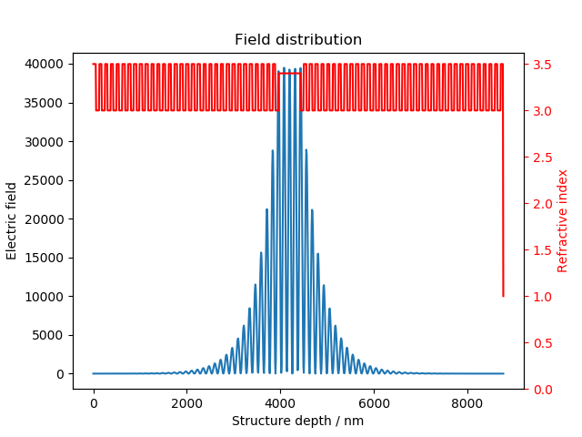

# microcavities
Personal code for analysis and simulations of polariton condensate physics

## Experiment
Mostly code that personalises [nplab](https://github.com/nanophotonics/nplab) for running polariton experiments.
Contains a few specific or slightly modified instrument classes, and some useful scripts for running during experimental runs.

The main feature is the Experiment class inside run.py, which opens instruments with appropriate addresses and 
arguments given in a yaml file. Once opened, it uses the nplab.utils.gui_generator to collects the instrument GUIs and 
places them inside a pyqtgraph.DockArea:

## Analysis

## utils
Hierarchical scan from a yaml. Can be used for both running and analysing experiments or simulations

## Simulations
Useful numerical procedures
### Transfer Matrix Method
Utility functions for microcavity design using [tmm](https://github.com/sbyrnes321/tmm) to solve the transfer matrix 
equations. Cavity parameters can be given as a yaml, and the normal incidence reflection, angular dispersion, and field 
distribution inside the cavity can be easily and quickly calculated and plotted.

### Gross Pitaevskii