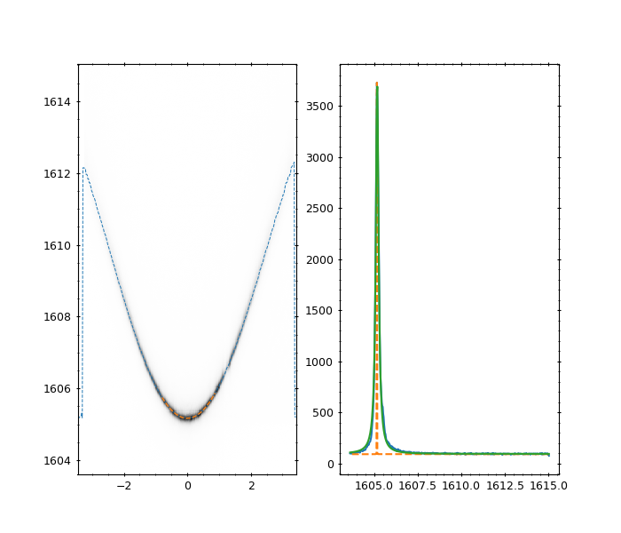
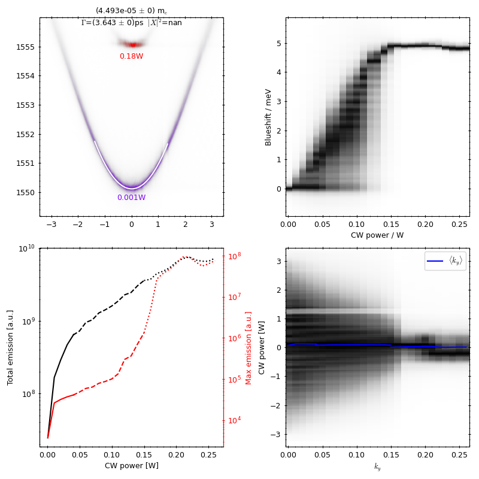

# Analysis

## Dispersion analysis
Utility code to analyse low-power dispersion PL images of polaritons. Main result is the following figure, which is the
result of [dispersion](../microcavities/analysis/dispersion.py).dispersion, and calculates the lower polariton mass, 
lifetime, energy and (if possible) exciton fraction:

```
dispersion(camera_image, wavevector_axis, energy_axis)
```


Can also perform a fit of the polariton curves using a 2-mode model of the polariton dispersion:

$$\partial_t\begin{pmatrix}  
\Phi\\\chi
\end{pmatrix}
=\begin{pmatrix}  
E_p & \Omega\\\Omega & E_{\chi}
\end{pmatrix}
\begin{pmatrix}  
\Phi\\\chi
\end{pmatrix}$$

where $\chi$ is the exciton wavefunction, $\Phi$ is the photon wavefunction, and $\Omega$ the Rabi splitting.

To perform the fit:

```
fit_dispersion(camera_image, wavevector_axis, energy_axis, plotting=True, mode='lp')
```


## Condensation analysis
Utility code to analyse the condensation of polaritons. Relies on having taken a power series scan using 
[HierarchicalScan](../microcavities/utils/HierarchicalScan.py).ExperimentScan with YAML files. 
Main result is the following figure, showing a few dispersion images, and three different quantities vs power: the k~0
spectra, the total/maximum emission, and the momentum distribution:

```
dispersion_power_series(YAML_paths, energy_axis=energy_axis, k_axis=k_axis)
```

