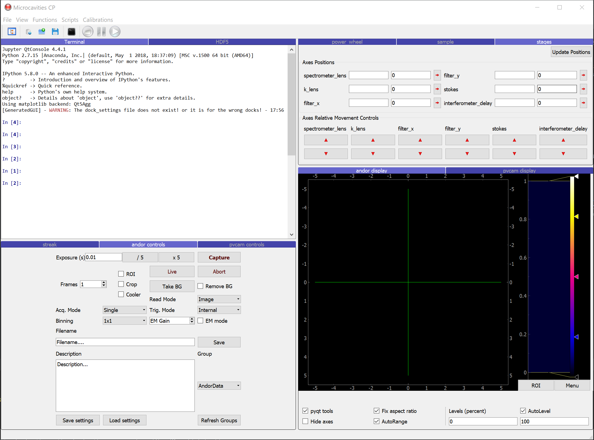

# Experiment
Mostly code that personalises [nplab](https://github.com/nanophotonics/nplab) for running polariton experiments.
Contains a few specific or slightly modified instrument classes, and some useful scripts for running during experimental runs.

The main feature is the Experiment class inside run.py, which opens instruments with appropriate addresses and 
arguments given in a yaml file. Once opened, it uses the nplab.utils.gui_generator to collects the instrument GUIs and 
places them inside a pyqtgraph.DockArea:

