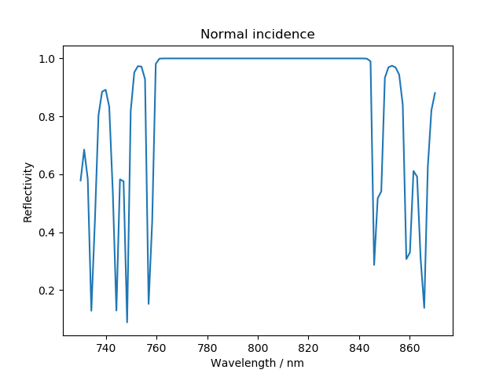
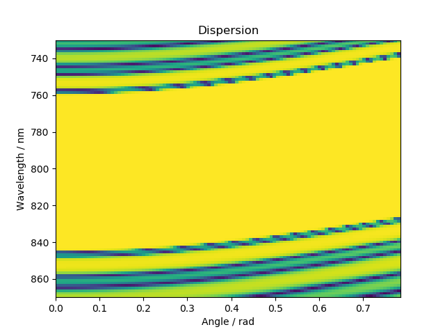
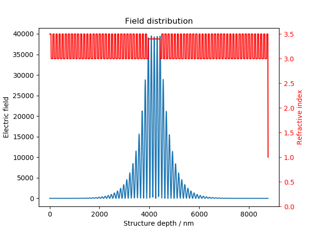
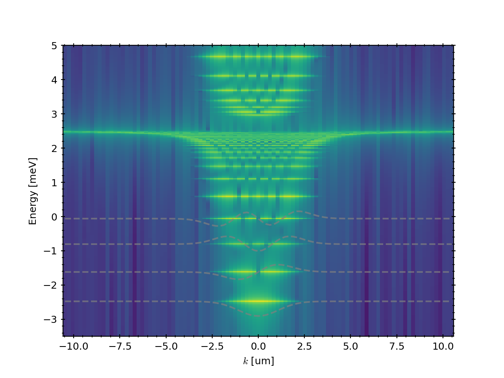
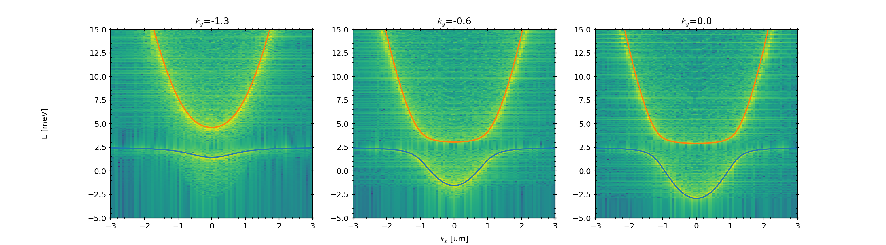
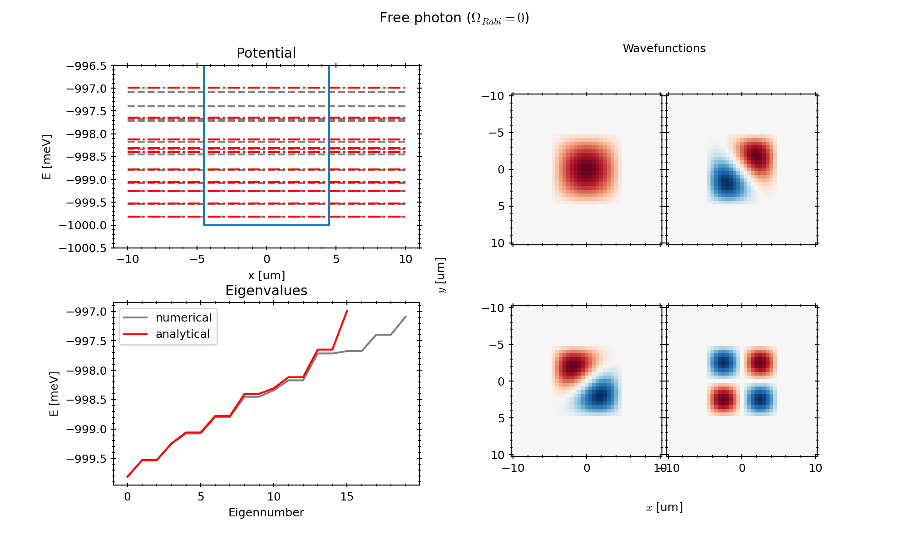
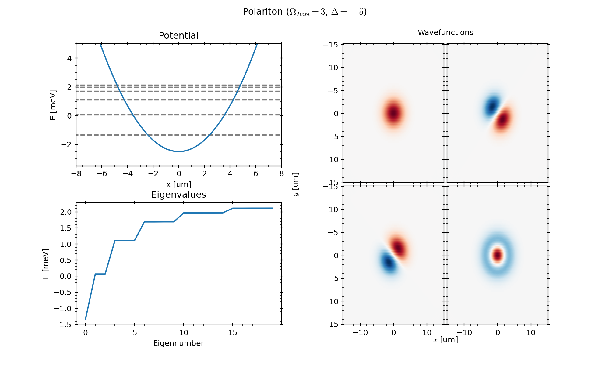

# Simulations
Useful numerical procedures:
- [Transfer matrix simulations](#transfer-matrix-method) 
- [Linear Schrödinger solver](#linear-schrödinger-solver)

## Transfer Matrix Method
Utility functions for microcavity design using [tmm](https://github.com/sbyrnes321/tmm) to solve the transfer matrix 
equations. Cavity parameters can be given as a yaml, and the normal incidence reflection, angular dispersion, and field 
distribution inside the cavity can be easily and quickly calculated and plotted.








## Linear Schrödinger solver
Direct diagonalisation solvers for polariton systems in one and two dimensions.

### One-dimensional examples
Farfield emission pattern from a harmonic potential on the photonic component of a 
polariton:
```
from microcavities.simulation.linear.one_d.realspace import *
test_farfield_harmonic_potential()
```


Farfield emission pattern from a conveyor belt potential (a travelling sinusoidal potential) on the excitonic component
of a polariton:
```
from microcavities.simulation.linear.one_d.realspace import *
test_farfield_conveyor_belt()
```


And then from the kspace of the same Hamiltonian, calculate the Chern number for the first three bands:
```
from microcavities.simulation.linear.one_d.realspace import *
test_farfield_conveyor_belt()
```


### Two-dimensional examples

First, simply the free-space dispersion relation, but obtained from farfield emission of realspace wavefunctions
and compared to analytical results (if you're interested in running it yourself, it took about ~5min to run on a normal
laptop):
```
from microcavities.simulations.linear.polariton_realspace import *
test_hamiltonian_freespace_x()
```


The second example is the infinite square well, for which we turn the Rabi coupling to zero and introduce a well in the
photon field. The numerical results agree very well with the analytical ones, although they start to diverge after the
~15th eigenstate, due to high-momenta components for which higher resolution spatial grids are needed.



The third example is a harmonic potential in the photonic part of a polariton system. The effect of the exciton-photon
coupling is to break the harmonicity of the potential, although it is possible to reduce this anharmonicity by having
the harmonic potential on both the exciton and photon component, the coupling to the exciton is a fundamental limit to
how many equally separated states a harmonic potential can have. 


